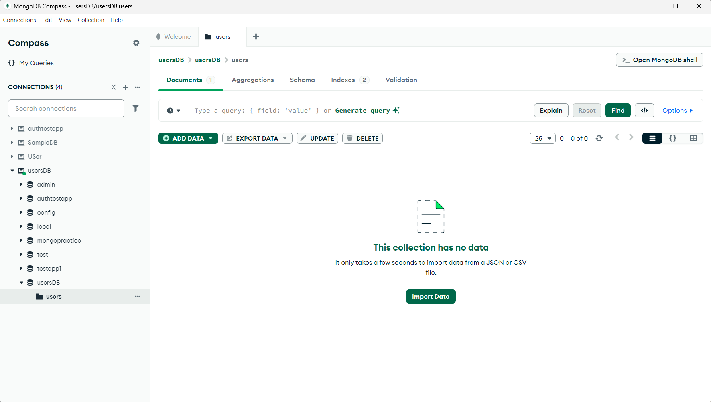
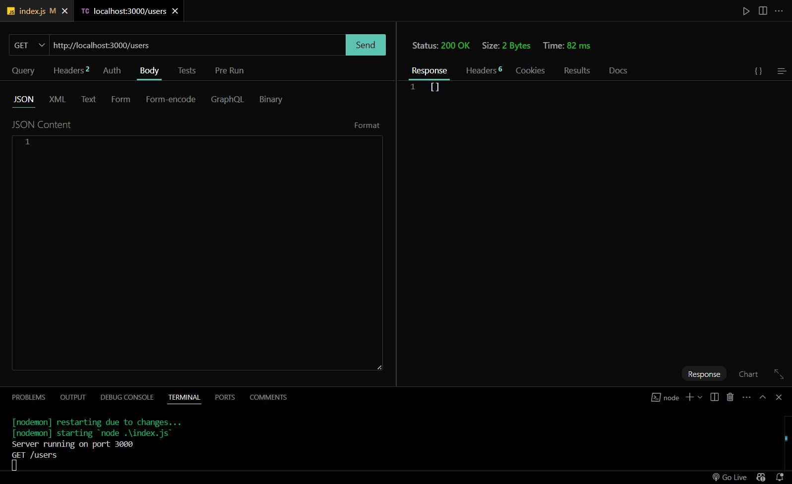
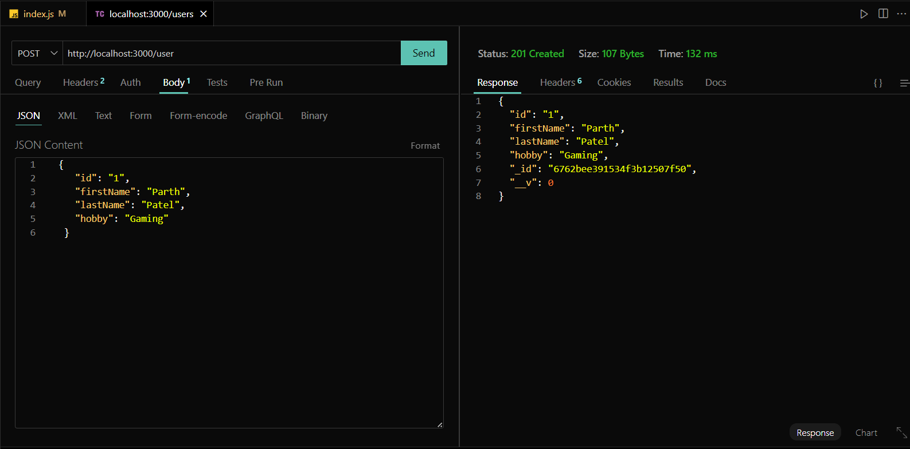
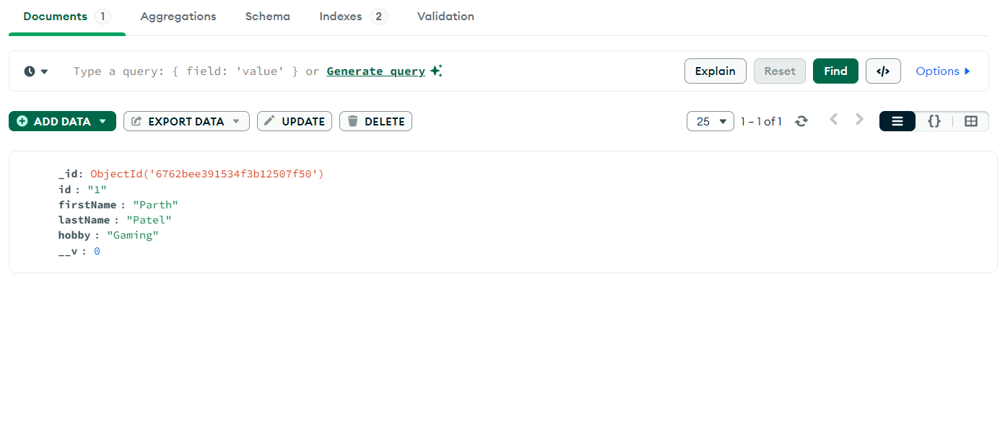
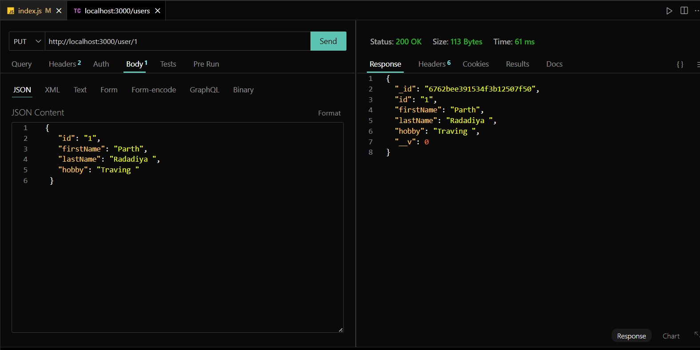
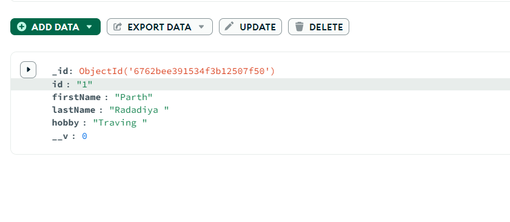
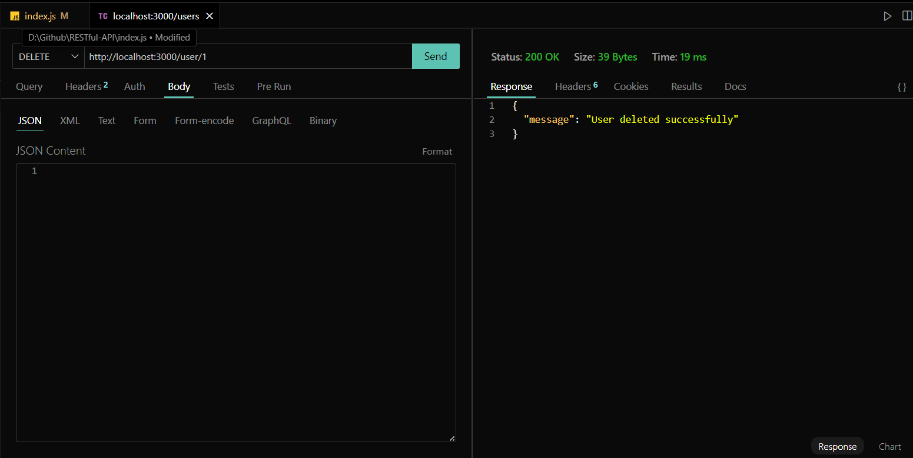
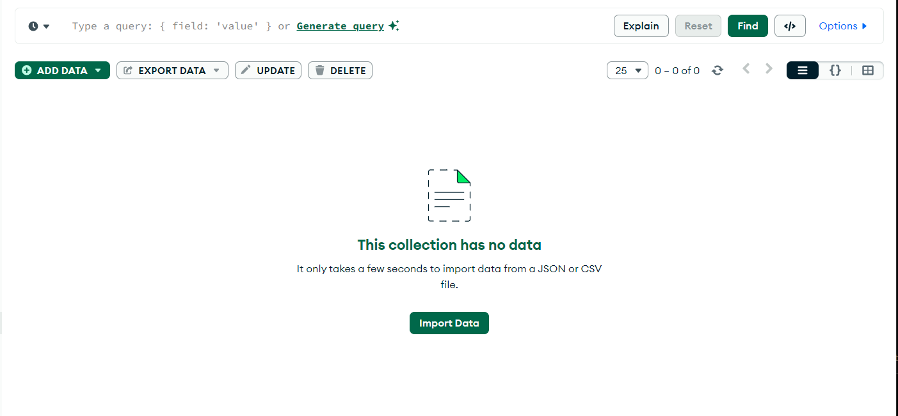
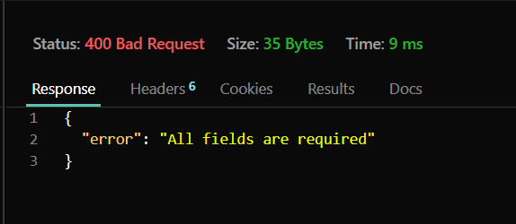
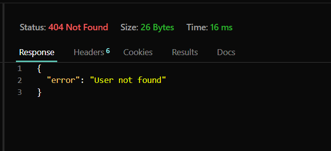

# User Management API

This is a simple Node.js and Express.js application for managing users. The application connects to a MongoDB database using Mongoose and provides a RESTful API for CRUD operations on user data.

---

## **GitHub Link**
- [GitHub Repository](https://github.com/parthu311/RESTful-API)

---

## **Description**
This project demonstrates a RESTful API built using Node.js, Express, and MongoDB for managing a list of users. It includes functionalities to perform CRUD (Create, Read, Update, Delete) operations on user data stored in a MongoDB database.

---

## **Features**
- Fetch all users.
- Fetch a specific user by ID.
- Add a new user.
- Update an existing user.
- Delete a user by ID.

---

## **Setup Instructions**

1. **Clone the Repository**
   - Clone the repository from GitHub:
     ```bash
     git clone https://github.com/parthu311/RESTful-API.git
     ```

2. **Install Dependencies**
   - Navigate to the project directory and install the required dependencies:
     ```bash
     npm install
     ```

3. **Setup MongoDB**
   - Ensure MongoDB is running locally on your system or provide a valid MongoDB connection string in the `mongoose.connect` function inside the code:
     ```javascript
     mongoose.connect("mongodb://localhost:27017/usersDB")
     ```

4. **Start the Server**
   - Run the following command to start the server:
     ```bash
     node index.js
     ```
   - By default, the server will run on `http://localhost:3000`.

5. **Test the API**
   - Use an API testing tool like **Postman** or **Thunder Client** to test the endpoints.

---

## **API Endpoints**

1. **GET /** or **GET /users**
   - Fetches the list of all users from the MongoDB database.

2. **GET /users/:id**
   - Fetches the details of a specific user by their `id`.

3. **POST /user**
   - Adds a new user to the database.
   - Requires `id`, `firstName`, `lastName`, and `hobby` fields in the request body.

4. **PUT /user/:id**
   - Updates the details of an existing user by their `id`.
   - Requires `firstName`, `lastName`, and `hobby` fields in the request body.

5. **DELETE /user/:id**
   - Deletes a user from the database by their `id`.

---

## **Middleware Features**

1. **Request Logger**
   - Logs the HTTP method and URL of each incoming request to the console.

2. **Validation Middleware**
   - Ensures that all required fields are provided in `POST` and `PUT` requests.

---

## **Error Handling**
- Returns meaningful error messages with appropriate HTTP status codes:
  - `404` for user not found.
  - `400` for missing or invalid input fields.
  - `201` for successful resource creation.
  - `200` for successful operations.
  - `500` for internal server errors.

---

## **Testing Instructions**

1. Test each endpoint using Postman or Thunder Client.
2. Verify both success and error scenarios.
3. Take screenshots of the API responses for documentation.

---

## **Screenshots**

- Add screenshots of your API tests here (e.g., responses from Postman):
   -Empty Compass and thunderClient
   
   

  -Post Data and Compass
  
  

   -Put Data and compass
  
  

  -Delete-data
  ;
  ;

   Errors
  
  

---

## **Project Author**
- Parth

