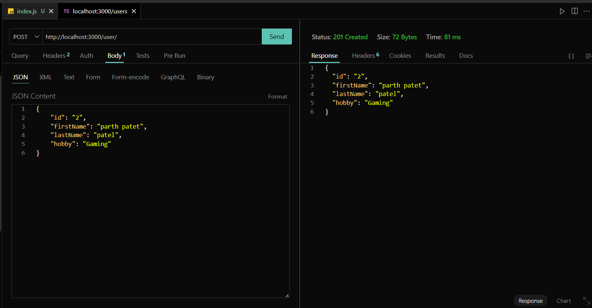
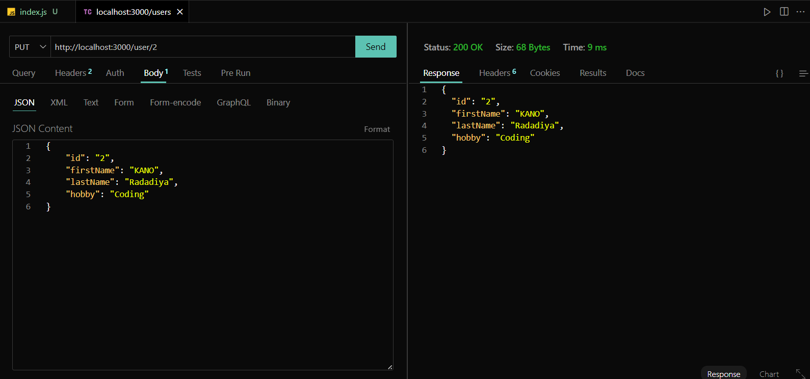
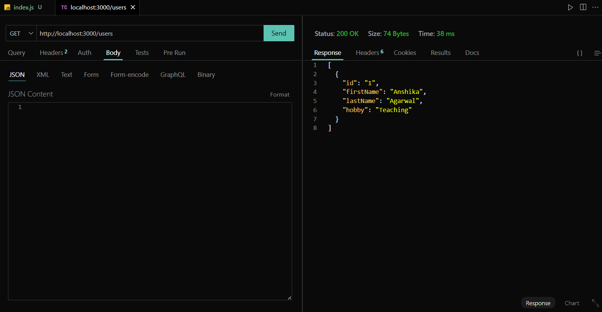
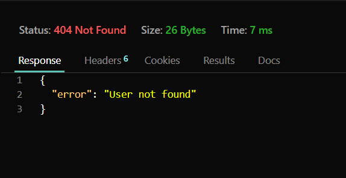
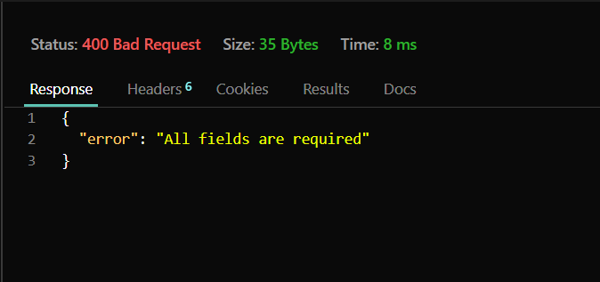
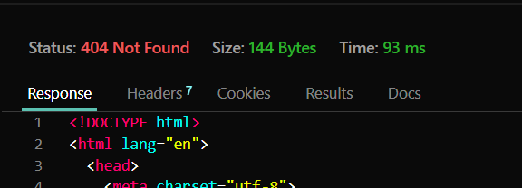

# RESTful API for Managing Users

# Github Link : https://github.com/parthu311/RESTful-API

## **Description**
This project demonstrates a RESTful API built using Node.js and Express for managing a list of users. It includes functionalities to perform CRUD (Create, Read, Update, Delete) operations on user data.

---

## **Features**
- Fetch all users
- Fetch a specific user by ID
- Add a new user
- Update an existing user
- Delete a user by ID

---

## **Setup Instructions**

1. **Install Dependencies**
   - Run `npm init` to install all required packages (e.g., Express).
   - npm install express

2. **Start the Server**
   - Use the command `node index.js` to start the server.
   - By default, the server will run on `http://localhost:3000`.

3. **Test the API**
   - Use API testing  **ThunderClient** to test the API endpoints.

---

## **API Endpoints**

1. **GET /users**
   - Fetches the list of all users.

2. **GET /users/:id**
   - Fetches the details of a specific user by their ID.

3. **POST /user**
   - Adds a new user to the list.
   - Requires `id`, `firstName`, `lastName`, and `hobby` fields in the request body.

4. **PUT /user/:id**
   - Updates the details of an existing user by their ID.
   - Requires `firstName`, `lastName`, and `hobby` fields in the request body.

5. **DELETE /user/:id**
   - Deletes a user by their ID.

---

## **Middleware Features**

1. **Request Logger**
   - Logs the HTTP method and URL of each incoming request to the console.

2. **Validation Middleware**
   - Ensures that all required fields are provided in `POST` and `PUT` requests.

---

## **Error Handling**
- Returns meaningful error messages with appropriate HTTP status codes:
  - `404` for user not found
  - `400` for missing or invalid input fields
  - `201` for successful resource creation
  - `200` for successful operations

---

## **Testing Instructions**

1. Test each endpoint using Thuder Client.
2. Take screenshots of successful and error scenarios for documentation.

---

## **Screenshots**

- Add screenshots of your API tests here (e.g., responses from Postman):
 
 
 
 
 
 
 

---

## **Project Author**
- Parth

